# DeerFlow 架构图

本文件将 DeerFlow 的整体架构整理为一组分层的 Mermaid 图，覆盖：系统拓扑、后端分层、Agent 运行时、工具/沙箱/技能、前端架构、请求数据流、IM 通道与扩展机制。

> 信息来源：[`docs/ARCHITECTURE.md`](ARCHITECTURE.md)、[`backend/AGENTS.md`](../backend/AGENTS.md)、[`backend/docs/ARCHITECTURE.md`](../backend/docs/ARCHITECTURE.md)、[`frontend/AGENTS.md`](../frontend/AGENTS.md)。

---

## 1. 系统拓扑（Service Topology）

Nginx 是唯一对外暴露的入口；Gateway 的 `8001` 端口仅容器内部可达，不对外发布。

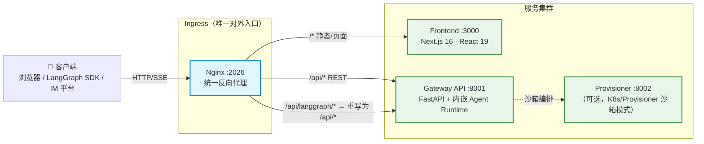

**Nginx 路由契约：**

| 路径 | 目标 |
|---|---|
| `/api/langgraph/*` | Gateway LangGraph 兼容运行时（重写为 `/api/*`） |
| `/api/*`（其它） | Gateway REST Routers |
| `/*` | Frontend |

---

## 2. 后端分层：Harness / App 边界

后端严格分为两层，**单向依赖**：`App → Harness`，Harness 永不导入 App（由 `test_harness_boundary.py` 强制）。

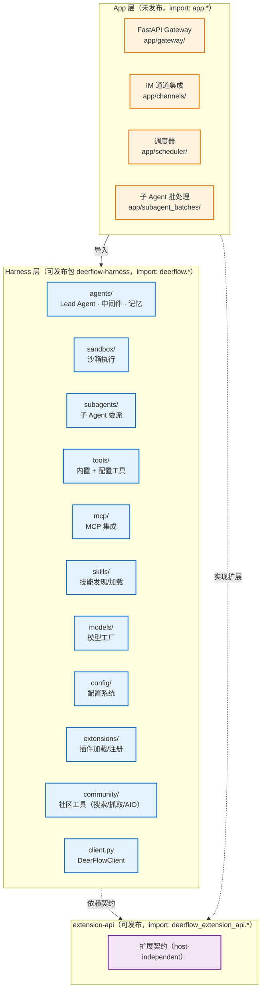

---

## 3. Agent 运行时与中间件链

所有运行模式（`make dev` / Docker / 生产）都通过 Gateway 内的 `RunManager` + `run_agent()` + `StreamBridge` 执行 Agent。`make_lead_agent()` 组装出的 Agent 被一条**中间件链**包裹，在模型调用前依次执行。

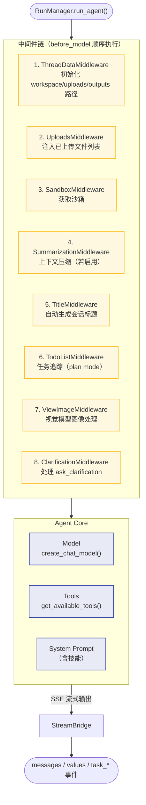

**ThreadState 字段（扩展自 LangGraph `AgentState`）：**

| 字段 | 说明 |
|---|---|
| `messages` | LangChain 消息列表 |
| `sandbox` | 沙箱环境信息 |
| `artifacts` | 生成的文件路径列表 |
| `thread_data` | `{workspace, uploads, outputs}` 路径 |
| `title` | 自动生成的会话标题 |
| `todos` | 任务追踪（plan mode） |
| `viewed_images` | 视觉模型图像数据 |

---

## 4. 工具系统

工具来自三个来源，由 `get_available_tools()` 合并。

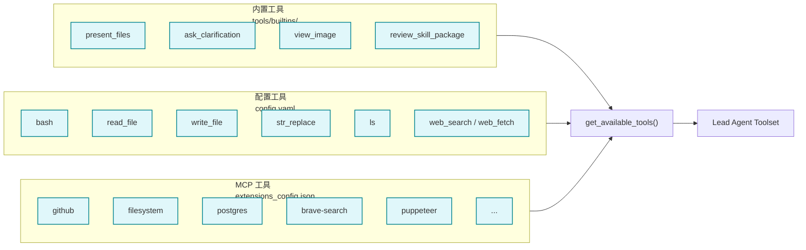

---

## 5. 沙箱系统

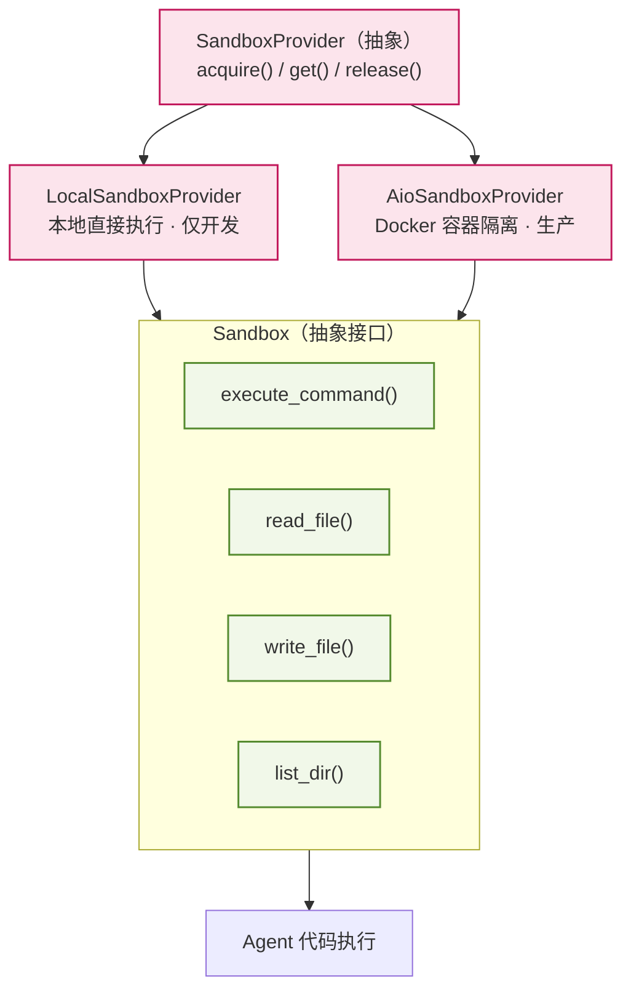

**虚拟路径映射：**

| 虚拟路径 | 物理路径 |
|---|---|
| `/mnt/user-data/workspace` | `backend/.deer-flow/threads/{thread_id}/user-data/workspace` |
| `/mnt/user-data/uploads` | `backend/.deer-flow/threads/{thread_id}/user-data/uploads` |
| `/mnt/user-data/outputs` | `backend/.deer-flow/threads/{thread_id}/user-data/outputs` |
| `/mnt/skills` | `deer-flow/skills/` |

---

## 6. 模型工厂

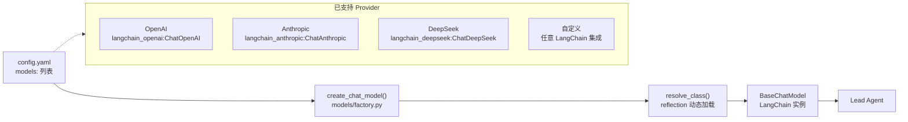

---

## 7. MCP 集成

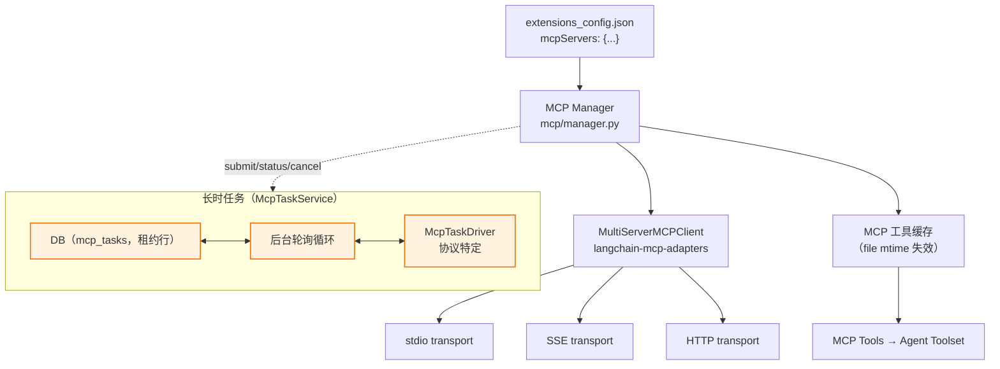

> 长时 MCP 任务走独立的持久化任务运行时，远程 task ID 与轮询不进入 Agent 主循环；DB 是唯一事实源。

---

## 8. 技能系统

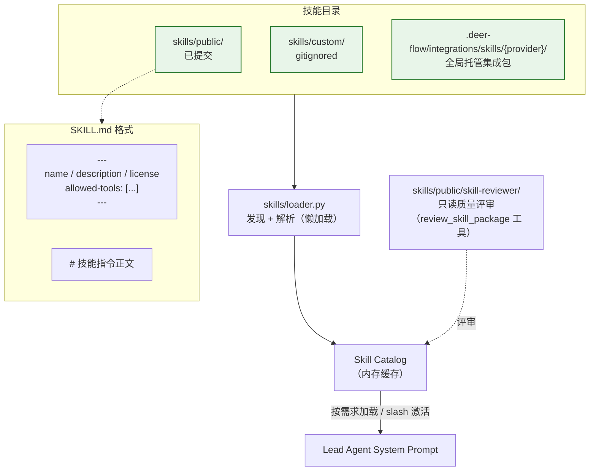

---

## 9. 前端架构

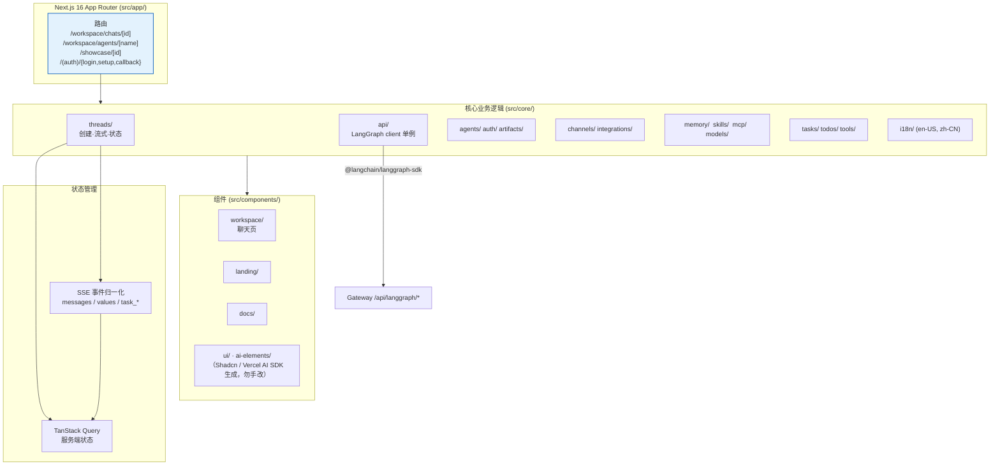

**前端数据流：** `core/threads/` 通过 `core/api/` 订阅 LangGraph run stream → 归一化 SSE 事件 → 写入 TanStack Query 管理的 thread state → 组件渲染。子任务进度走根命名空间 `task_*` 自定义事件。

---

## 10. 请求与运行数据流

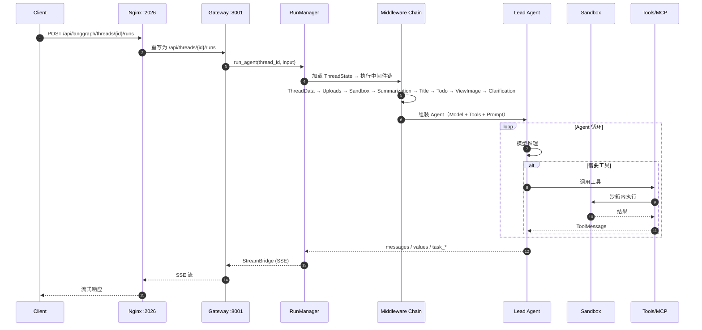

---

## 11. IM 通道集成

外部 IM 平台通过 Gateway 的同一 Agent 接入。

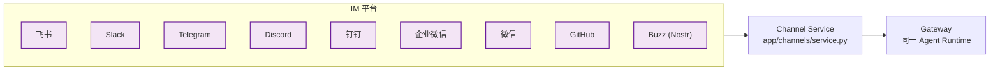

---

## 12. 调度器与定时任务

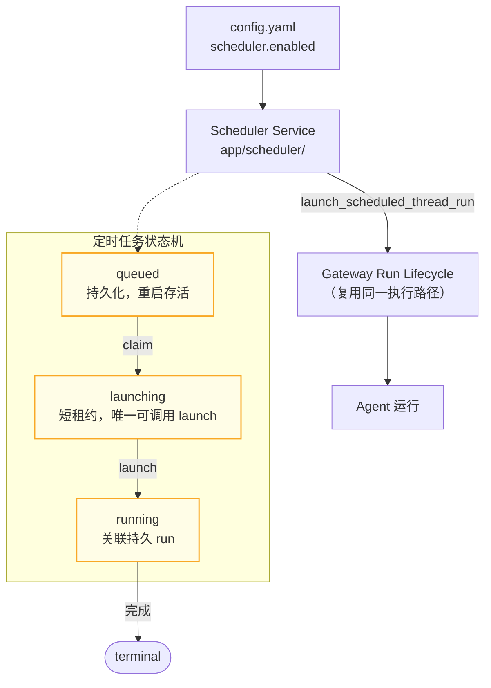

> 定时任务**复用** Gateway 的 run 生命周期；调度器只决定"何时"，不引入并行执行栈。非交互运行会移除 `ask_clarification` 工具。

---

## 13. 安全与隔离模型

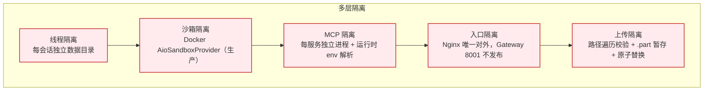

---

## 图例速查

| 颜色 | 含义 |
|---|---|
| 🟦 蓝 | Harness 层 / 前端 |
| 🟧 橙 | App 层 |
| 🟪 紫 | 扩展契约 / IM |
| 🟩 绿 | 前端 / 服务 |
| 🟨 黄 | 中间件 / 状态 |
| 🟥 红 | 安全隔离 |
| 🟦 青 | 工具来源 |
